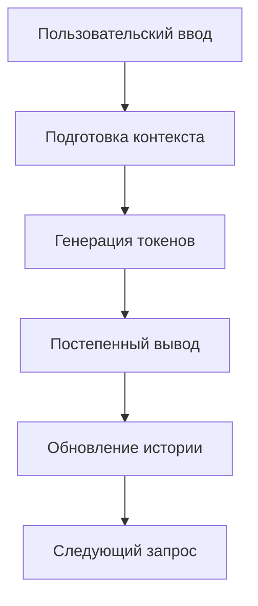

# Чат-бот с потоковой генерацией

В этом проекте представлен пример реализации чат-бота на основе модели *Gemma-3-1b-it* от Google, которую мы запускаем локально. 



Для запуска этого скрипта вам нужен доступ к графическому процессору GPU и модель *Gemma-3-1b-it* на вашем устройстве.

## Что можно улучшить в базовом скрипте?

**История сообщений** с поддержкой *in-context learning*.

Создать хранилище истории сообщений, которое вы будете подгружать в input модели в пределах контекстного окна либо использовать [готовые инструменты](https://python.langchain.com/docs/concepts/chat_history/)


*Источник изображения: https://python.langchain.com/docs/concepts/chat_history/*

**Семантический поиск** для реализации *Retrieval-Augmented Generation*


*Источник изображения: https://learn.microsoft.com/en-us/data-engineering/playbook/solutions/vector-database/*

- Собираем базу данных под свою задачу
- Преобразовываем структуру данных к виду векторной базы данных (например, с помощью [FAISS](https://ai.meta.com/tools/faiss/), [Chroma](https://docs.trychroma.com/docs/overview/introduction))
- Сравниваем векторное сходство запроса пользователя и результатов в базе данных
- Скармливаем результат поиска большой языковой модели

**Сжатие модели**


*Источник изображения: https://arxiv.org/pdf/2404.03085*

Сжатие позволяет запускать модели на слабых GPU, без графического процессора и даже на мобильном устройстве.

[Методы сжатия моделей ИИ](https://huggingface.co/docs/transformers/en/quantization/concept_guide): [GPTQ](https://huggingface.co/docs/transformers/en/quantization/gptq), [GGUF](https://huggingface.co/docs/hub/en/gguf),[FP8](https://huggingface.co/docs/transformers/en/quantization/finegrained_fp8)

В нашем скрипте мы используем библиотеку [bitsandbytes](https://github.com/bitsandbytes-foundation/bitsandbytes) для 8-битного сжатия модели. Некоторые разработчики сами предоставляют доступ к сжатым моделям, например, [Qwen](https://huggingface.co/Qwen/Qwen2.5-32B-Instruct-GPTQ-Int4) или [Gemma](https://huggingface.co/google/gemma-3-27b-it-qat-q4_0-gguf)

## Используемые библиотеки

Основные зависимости:
- `transformers` - работа с моделями HuggingFace
- `torch` - тензорные операции
- `bitsandbytes` - 8-битная квантизация
- `re` - обработка регулярных выражений
- `threading` и `queue` - многопоточность

Дополнительные библиотеки для расширений:
- `sentence-transformers` - эмбеддинги текста
- `faiss` или `chromadb` - векторный поиск
- `langchain` - интеграция компонентов, например, истории поиска

## Пример использования

Базовый запрос:

```python
python run.py
> Привет! Кто ты?
```
   
## Источники и ссылки

- [Gemma на HuggingFace](https://huggingface.co/google/gemma-3-1b-it)
- [LangChain документация](https://python.langchain.com/)
- [FAISS руководство](https://github.com/facebookresearch/faiss)
- [Sentence Transformers](https://www.sbert.net/)

## Установка

```bash
pip install torch transformers bitsandbytes
```
