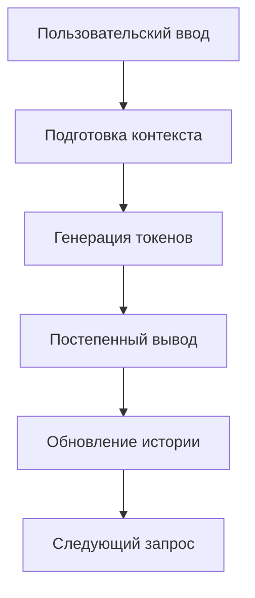

# Чат-бот с потоковой генерацией

В этом проекте представлен пример реализации чат-бота на основе модели *Gemma-3-1b-it* от Google, которую мы запускаем локально. 



Для запуска этого скрипта вам нужен доступ к графическому процессору GPU и модель *Gemma-3-1b-it* на вашем устройстве.

## Что можно улучшить в базовом скрипте?

**История сообщений** с поддержкой *in-context learning*.

Создать хранилище истории сообщений, которое вы будете подгружать в input модели в пределах контекстного окна либо использовать [готовые инструменты](https://python.langchain.com/docs/concepts/chat_history/)


*Источник изображения: https://python.langchain.com/docs/concepts/chat_history/*

**Семантический поиск** для реализации *Retrieval-Augmented Generation*


*Источник изображения: https://learn.microsoft.com/en-us/data-engineering/playbook/solutions/vector-database/*

- Собираем базу данных под свою задачу
- Преобразовываем структуру данных к виду векторной базы данных (например, с помощью [FAISS](https://ai.meta.com/tools/faiss/), [Chroma](https://docs.trychroma.com/docs/overview/introduction))
- Сравниваем векторное сходство запроса пользователя и результатов в базе данных
- Скармливаем результат поиска большой языковой модели


- Потоковая генерация ответов (постепенный вывод токенов)
- Поддержка истории сообщений (для in-context learning)
- 8-битная квантизация для экономии вычислительных ресурсов (добавлена в код)

## Схема работы


## Используемые библиотеки

Основные зависимости:
- `transformers` - работа с моделями HuggingFace
- `torch` - тензорные операции
- `bitsandbytes` - 8-битная квантизация
- `re` - обработка регулярных выражений
- `threading` и `queue` - многопоточность

Дополнительные библиотеки для расширений:
- `sentence-transformers` - эмбеддинги текста
- `faiss` или `chromadb` - векторный поиск
- `langchain` - интеграция компонентов

## Примеры использования

1. Базовый запрос:
   ```python
   python run.py
   > Привет! Кто ты?
   ```

2. С историей диалога (расширенная версия):
   ```python
   from collections import deque
   chat_history = deque(maxlen=5)  # Ограничение длины истории
   ```

3. С семантическим поиском:
   ```python
   from sentence_transformers import SentenceTransformer
   encoder = SentenceTransformer('all-MiniLM-L6-v2')
   ```

## Источники и ссылки

- [Gemma на HuggingFace](https://huggingface.co/google/gemma-3-1b-it)
- [LangChain документация](https://python.langchain.com/)
- [FAISS руководство](https://github.com/facebookresearch/faiss)
- [Sentence Transformers](https://www.sbert.net/)

## Установка

```bash
pip install torch transformers bitsandbytes sentence-transformers faiss-cpu
```
